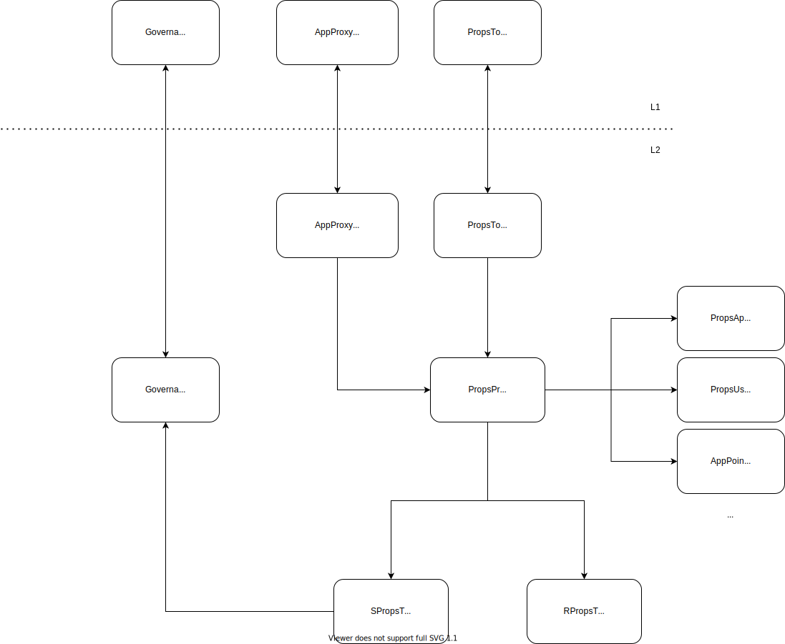

## Props Protocol

> #### A decentralized protocol for loyalty tokens.

For a high-level overview of Props, and what these contracts are aiming to acheive, we recommend starting with the [whitepaper](https://www.propsproject.com/hubfs/Props_December_2020/Docs/PropsWhitepaper.pdf), which is only 9 pages long.

When it comes to implementation, an important detail is that the Props Token originates on Ethereum (L1), while the Props Protocol is primarily implemented on a Layer 2 (Matic / Polygon). The documentation below goes into more technical detail about the various components, and how they function across L1 and L2.

## Core Components

- [AppPoints](./docs/AppPoints.md)
- [AppProxyFactory](./docs/AppProxyFactory.md)
- [PropsProtocol](./docs/PropsProtocol.md)
- [PropsToken](./docs/PropsToken.md)
- [RPropsToken](./docs/RPropsToken.md)
- [Staking](./docs/Staking.md)
- [Governance](./docs/Governance.md)

## Guides

- [Roles and permissions](./docs/RolesAndPermissions.md)
- [Bridging](./docs/Bridging.md)
- [Deployment](./docs/Deployment.md)
- [L2 migration](./docs/L2Migration.md)
