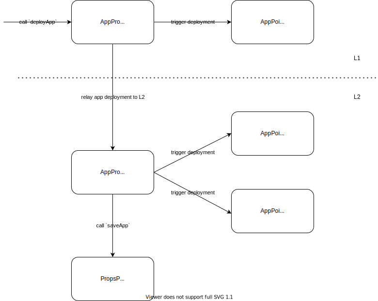

## `AppProxyFactory`

The `AppProxyFactory` contract is responsible for deploying new apps that are to be integrated within the Props protocol. Like AppPoints tokens, it comes in two variants, one for deploying new apps on L1 and another for a similar deployment on L2. However, external actors can only interact with the L1 variant of the factory. An L2 app deployment can only be triggered indirectly via an L1 app deployment (deploying a new app on L1 will trigger a corresponding app deployment on L2 via the app deployment bridge). The major difference between the L1 and L2 variants of the factory is that the L1 factory will only create an L1 AppPoints token, while the L2 factory will create both an L2 AppPoints token together with a corresponding staking contract for the L2 AppPoints tokens.

Contracts of interest:

- `AppProxyFactoryL1`: includes L1-specific factory functionality
- `AppProxyFactoryL2`: includes L2-specific factory functionality
- `AppProxyFactoryBridgeL1`: L1 bridge contract for relaying app deployments to L2
- `AppProxyFactoryBridgeL2`: L2 bridge contract for handling app deployments coming from L1

Here is a high-level overview of the interactions between the different protocol contracts when deploying a new app:



## Architecture

The following functions are only available on the L1 variant of the factory:

##### Deploy app

Deploy a new app for integration within the Props protocol. This action will deploy an AppPoints token on L1 but will also trigger a corresponding deployment on L2 which will create an L2 AppPoints token together with a corresponding staking contract for it. The new app will also be automatically integrated within the Props protocol on L2.

```solidity
function deployApp(
    string _name,
    string _symbol,
    uint256 _amount,
    address _owner,
    uint256 _dailyRewardEmission
)
```
